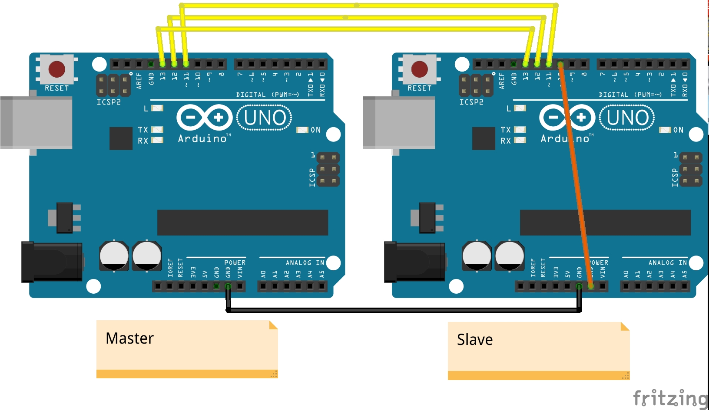

# SPI - Serial Peripheral Interface

I tre protocolli standard di comunicazione tra microcontrollori sono la comunicazione seriale (UART/USART), I2C e SPI. In questo sketch è presentato SPI.

**Per informazioni teoriche dettagliate**: [http://maxembedded.com/2013/11/serial-peripheral-interface-spi-basics/](http://maxembedded.com/2013/11/serial-peripheral-interface-spi-basics/)  

**Per gestire SPI in AVR**: [http://maxembedded.com/2013/11/the-spi-of-the-avr/](http://maxembedded.com/2013/11/the-spi-of-the-avr/)

## Setup del circuito

In questa modalità il Master invia ripetutamente la stringa `Hello World\n` allo Slave, carattere per carattere (SPI è sempre una comunicazione seriale!!). Lo Slave quando legge `\n` invia la stringa completa al PC via seriale perché possa essere visualizzata.

**N.B**: Si deve collegare al PC prima lo Slave perché così gli sarà associata la porta /dev/ttyACM0 per comunicare con il PC e solo dopo il Master.

**Compilazione, flashing su Arduino ed esecuzione**

`$ make master.hex`

`$ make slave.hex`

**Monitorare i messaggi di output dello Slave con il mio programma**: `$ ./myScreen`

In alternativa installare il tool più usato:

`$ sudo apt-get install screen`

`$ screen /dev/ttyACM0 115200`
