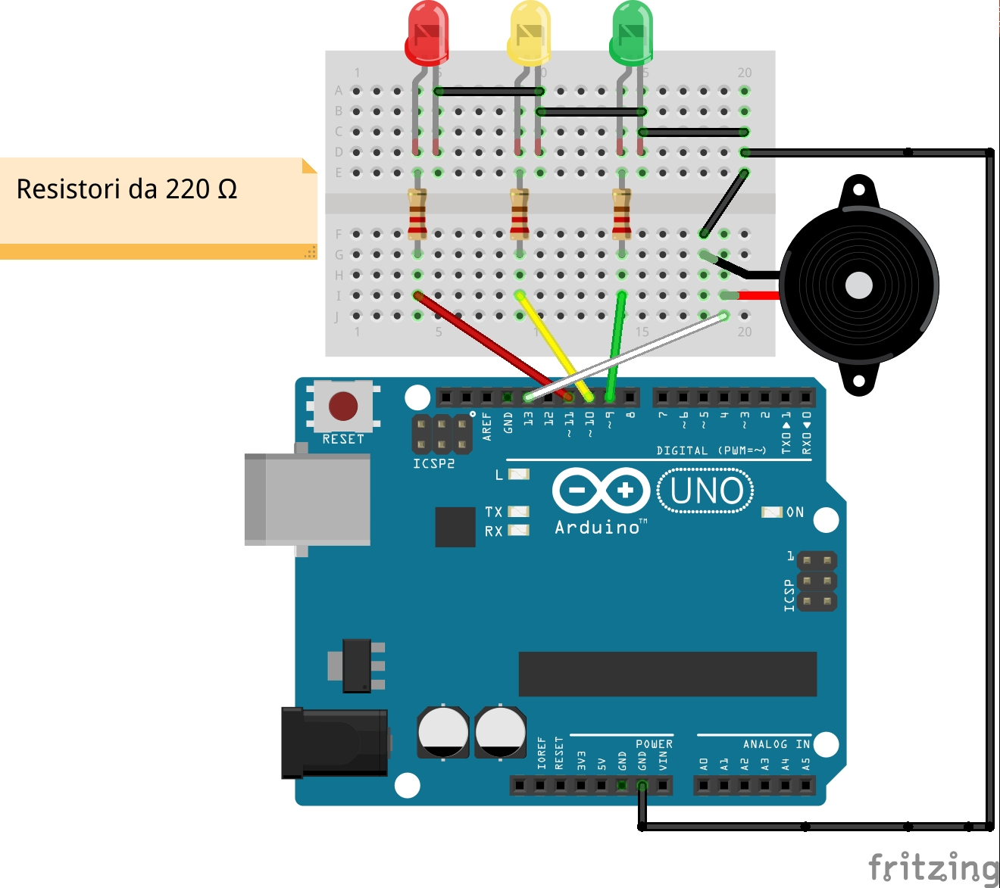

# Semaforo per non udenti

**Compilazione, flashing su Arduino ed esecuzione**

`$ make semaphore.hex`

Ogni 4.195 secondi un timer interrupt permette al semaforo di passare dal rosso, al verde e al giallo. Quando il semaforo è verde l'active buzzer emette un beep ogni 500 ms; quando è giallo un beep ogni 250 ms.

**N.B**: i timer AVR sono particolari registri il cui valore cresce e decresce automaticamente. Un registro a 8 bit è in grado di contare fino a 2^8-1 = 255; un registro a 16 bit fino a 2^16-1 = 65535. Per questo motivo i timer sono detti anche contatori. Quando il MAX è superato (overflow) il valore è riportato a zero. Nell'ATmega328 esistono i registri TIMER0 (8 bit), TIMER1(16 bit), TIMER2 (8 bit). Per coprire il maggior intervallo temporale possibile si usa pertanto TIMER1, ma con una frequenza pari a 16 MHz e un prescaler pari a 1024 (si veda qui la spiegazione tecnica [https://maxembedded.wordpress.com/2011/06/28/avr-timers-timer1/](https://maxembedded.wordpress.com/2011/06/28/avr-timers-timer1/)) il massimo delay supportato è 4195 ms. Un intervallo di durata superiore causerebbe un overflow. 
