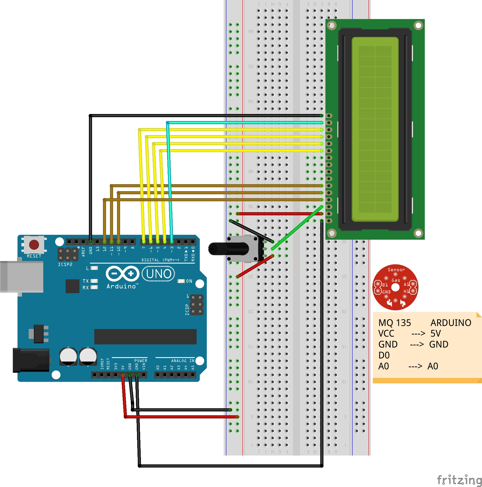

# MQ135 - Sensore qualità dell'aria

Il valore di output del sensore cresce nell'intervallo `[0,1023]` in proporzione alla quantità di gas pericolosi come NH3, NOx, alcol, benzene, fumo, CO2.

**Compilazione, flashing su Arduino ed esecuzione**

`$ make MQ135_test.hex` // output su terminale

`$ make MQ135_LCD_test.hex` // output su LCD 16x2 screen

**Valori registrati**

- condizioni normali: circa 100-150
- alcol: circa 700
- polveri sottili: circa 750

**N.B**: si può anche ricavare la quantità precisa di un gas (e.g. CO2) in PPM (parts per million) seguendo le guide su internet.
