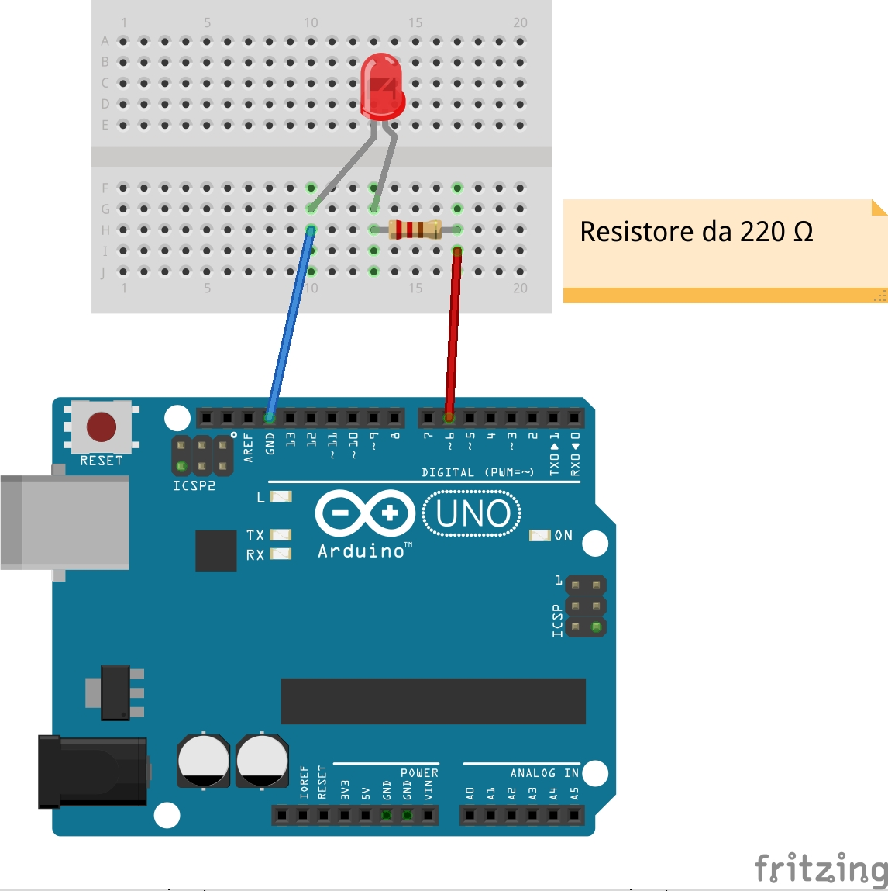

# PWM

PWM: *Pulse Width Modulation*

La modulazione di larghezza di impulso permette al microcontrollore (digitale) di interfacciarsi con il mondo reale (analogico).  Il PWM è usato in questo sketch per variare la luminosità del LED nell'intervallo 0-255 (effetto fade), e non più 0 oppure 1 come nei i segnali digitali.

**N.B.** Nell'Arduino Uno i pin digitali che possono essere usati anche per generare segnali analogici sono il 3, 5, 6, 9, 10, 11. Nell'esempio è stato scelto il 6.
