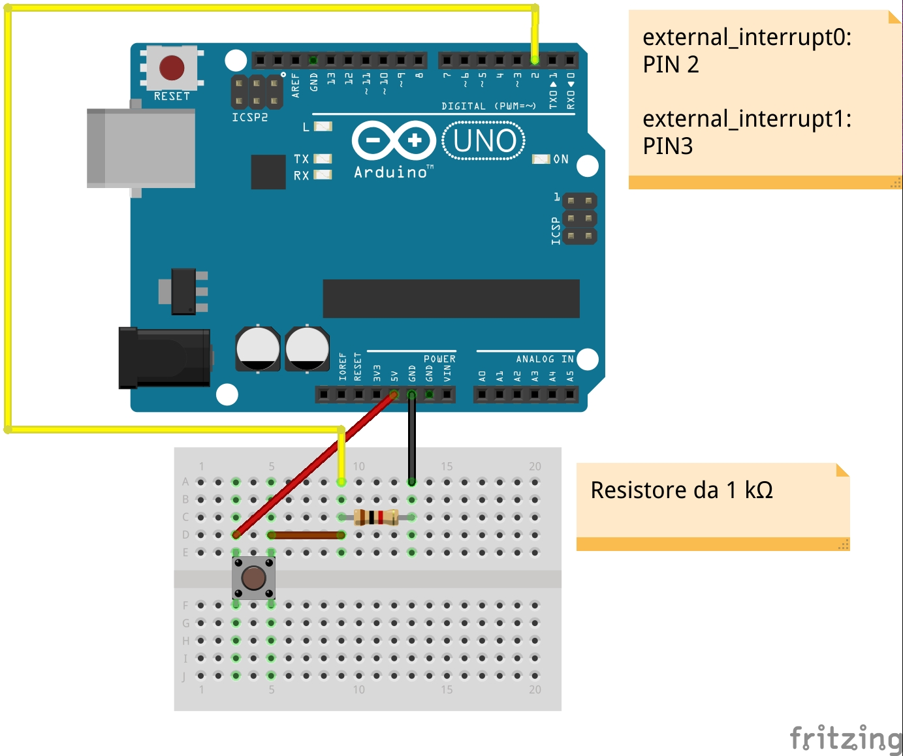

# Accensione del LED tramite External Interrupt

Sono presenti due versioni: button collegato alla porta PD2 (INT0) e button collegato alla porta PD3 (INT1). Queste porte sono mappate su Arduino Uno rispettivamente sui pin digitali 2 e 3.

Il microcontrollore non esegue alcun codice nel loop. La pressione del bottone genera un external interrupt che provoca l'accensione del LED e l'invio di un messaggio via seriale (On/Off).

**AVR External Interrupt**: [http://exploreembedded.com/wiki/AVR_External_Interrupts](http://exploreembedded.com/wiki/AVR_External_Interrupts)

**Gestione degli INTx**: [https://sites.google.com/site/qeewiki/books/avr-guide/external-interrupts-on-the-atmega328](https://sites.google.com/site/qeewiki/books/avr-guide/external-interrupts-on-the-atmega328)

**Compilazione, flashing su Arduino ed esecuzione**

`$ make external_interrupt0.hex`

`$ make external_interrupt1.hex`

**Monitorare i messaggi di output di Arduino con il mio programma**: `$ ./myScreen`

In alternativa installare il tool più usato:

`$ sudo apt-get install screen`

`$ screen /dev/ttyACM0 115200`
