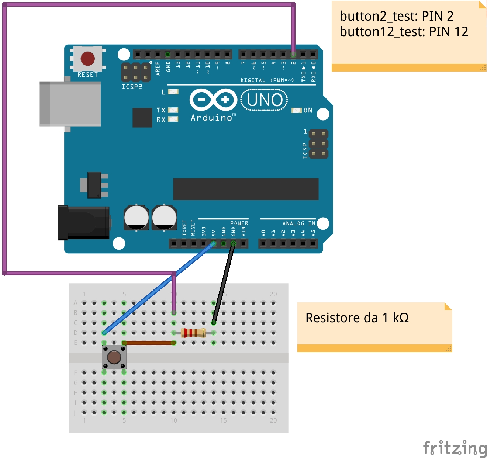

# Accensione del LED tramite interrupt

Sono presenti due versioni: button collegato al pin 2 e button collegato al pin 12. La gestione del pin change interrupt (PCINTx) varia di conseguenza ed occorre pertanto controllare il mapping della scheda Arduino. 

Il microcontrollore non esegue alcun codice nel loop. La pressione del bottone genera un pin change interrupt che provoca l'accensione del LED e l'invio di un messaggio via seriale (On/Off).

**Solo per il setup della breadboard**: [https://www.youtube.com/watch?v=XpJYrIstaVA](https://www.youtube.com/watch?v=XpJYrIstaVA)

**Interrupt in AVR**: [http://www.nongnu.org/avr-libc/user-manual/group__avr__interrupts.html](http://www.nongnu.org/avr-libc/user-manual/group__avr__interrupts.html)

**Gestione dei PCINTx**: [https://sites.google.com/site/qeewiki/books/avr-guide/external-interrupts-on-the-atmega328](https://sites.google.com/site/qeewiki/books/avr-guide/external-interrupts-on-the-atmega328)

**Compilazione, flashing su Arduino ed esecuzione**

`$ make button2_test.hex`

`$ make button12_test.hex`

`$ gcc -o myScreen myScreen.c`

**Monitorare i messaggi di output di Arduino con il mio programma**: `$ ./myScreen`

In alternativa installare il tool più usato:

`$ sudo apt-get install screen`

`$ screen /dev/ttyACM0 115200`
