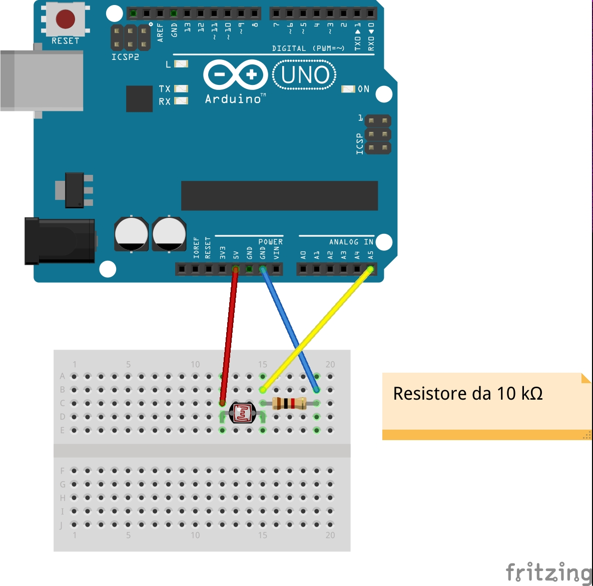

# Analog_Input

Nel mondo reale grandezze come la temperatura e la pressione sono analogiche: la funzione del convertitore analogico digitale (ADC) è di convertire il segnale analogico registrato dal sensore in un segnale digitale perché possa essere elaborato dal microcontrollore, che è appunto digitale.

In questo sketch l'MCU legge in input il valore registrato dalla fotoresistenza collegata al pin A5. L'ADC inzia la conversione e una volta completata genera un segnale che viene catturato. L'ISR legge il valore convertito (scala da 0 a 1023) e, se risulta minore di 128, accende per 1000 ms il LED collegato al pin 13 e invia un messaggio via seriale.

**Cos'è una fotoresistenza e setup della breadboard**: [https://www.youtube.com/watch?v=ZEygo6f_70Q&index=10&list=PLu3ADb4nfjU27IitiNqskKRdfHhc-X2LQ](https://www.youtube.com/watch?v=ZEygo6f_70Q&index=10&list=PLu3ADb4nfjU27IitiNqskKRdfHhc-X2LQ)

**Cos'è l'ADC**: [http://maxembedded.com/2011/06/the-adc-of-the-avr/](http://maxembedded.com/2011/06/the-adc-of-the-avr/)

**AVR ADC interrupt**: [http://www.avrfreaks.net/forum/tut-c-newbies-guide-avr-adc?page=all](http://www.avrfreaks.net/forum/tut-c-newbies-guide-avr-adc?page=all)

**Compilazione, flashing su Arduino ed esecuzione**

`$ make adc_test.hex`

**Monitorare i messaggi di output di Arduino con il mio programma**: `$ ./myScreen`
