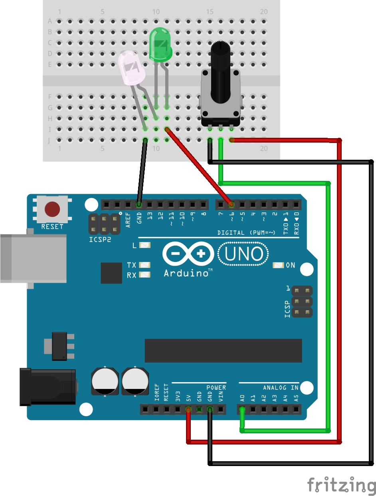

# Potenziometro e LED in serie

**Potenziometro**: [https://www.youtube.com/watch?v=tZN2D5cABDQ&list=PLu3ADb4nfjU27IitiNqskKRdfHhc-X2LQ&index=9](https://www.youtube.com/watch?v=tZN2D5cABDQ&list=PLu3ADb4nfjU27IitiNqskKRdfHhc-X2LQ&index=9)

**LED in serie**: [https://www.youtube.com/watch?v=WAvzX-8Oqlw&list=PL5zHZPAxZldqID2f-2g4tWT-0ePiRfUlN&index=5](https://www.youtube.com/watch?v=WAvzX-8Oqlw&list=PL5zHZPAxZldqID2f-2g4tWT-0ePiRfUlN&index=5)

**Compilazione, flashing su Arduino ed esecuzione**

`$ make potentiometer_test.hex`

**Monitorare i messaggi di output di Arduino con il mio programma**: `$ ./myScreen`
