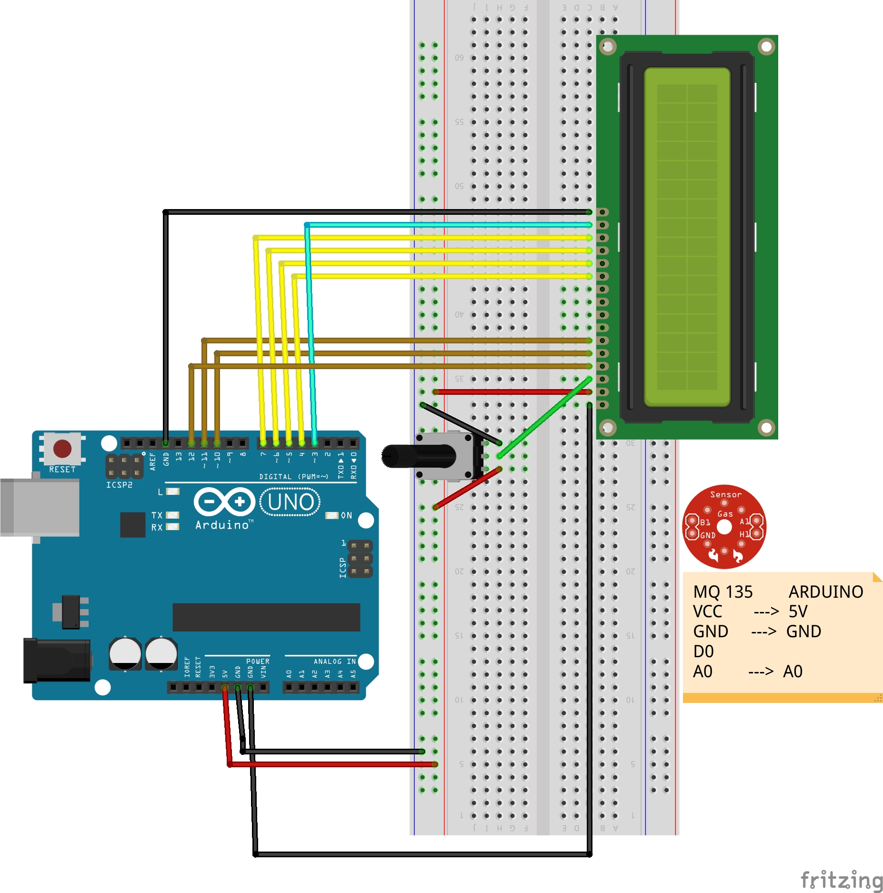

# LCD - 4-bit Mode

Seguire le istruzioni di uno dei due link seguenti per configurare il PinMapping.

**AVR-GCC 4 bit and 8 bit LCD library**: [http://winavr.scienceprog.com/example-avr-projects/avr-gcc-4-bit-and-8-bit-lcd-library.html](http://winavr.scienceprog.com/example-avr-projects/avr-gcc-4-bit-and-8-bit-lcd-library.html)

**Interfacing a HD44780 Based LCD to an AVR**: [http://homepage.hispeed.ch/peterfleury/doxygen/avr-gcc-libraries/group__pfleury__lcd.html](http://homepage.hispeed.ch/peterfleury/doxygen/avr-gcc-libraries/group__pfleury__lcd.html)

L'immagine mostra un'applicazione dell'LCD: si osservino i collegamenti.

**Compilazione, flashing su Arduino ed esecuzione**

`$ make main.hex` // questo è l'esempio ufficiale della prima libreria

`$ make blink_test.hex`

`$ make lcd_test.hex` // questo è un esempio della seconda libreria

**N.B.**: negli sketches successivi userò solo la libreria di Peter Fleury perché è compatibile con l'ATmega2560 cambiando opportunamente le porte.
